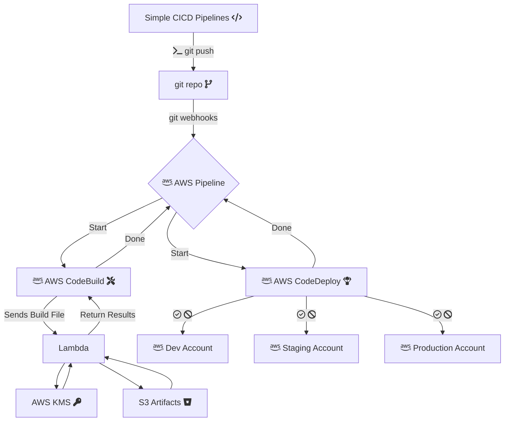

# AWS Pipelines with CDK Typescript

A serverless CI/CD platform leveraging native AWS services provisioned using the AWS Cloud Development Kit (CDK). As per the AWS Well Architected Framework, this project assumes the use of multiple AWS accounts for secure isolation of environments.

`To see the flowchart -` https://marketplace.visualstudio.com/items?itemName=bierner.markdown-mermaid

## Defining your environment & projects

### AWS CodePipeline

### Security

### AWS CodeBuild

### Monitoring 

### AWS CodeDeploy

### AWS services

- AWS CodeCommit (or any source control provider supported by CodePipeline)
- AWS CodePipeline
- AWS CodeBuild
- AWS Lambda
- AWS S3
- AWS SNS
- AWS CloudWatch
- AWS Systems Manager: Parameter Store
- AWS CloudFormation
